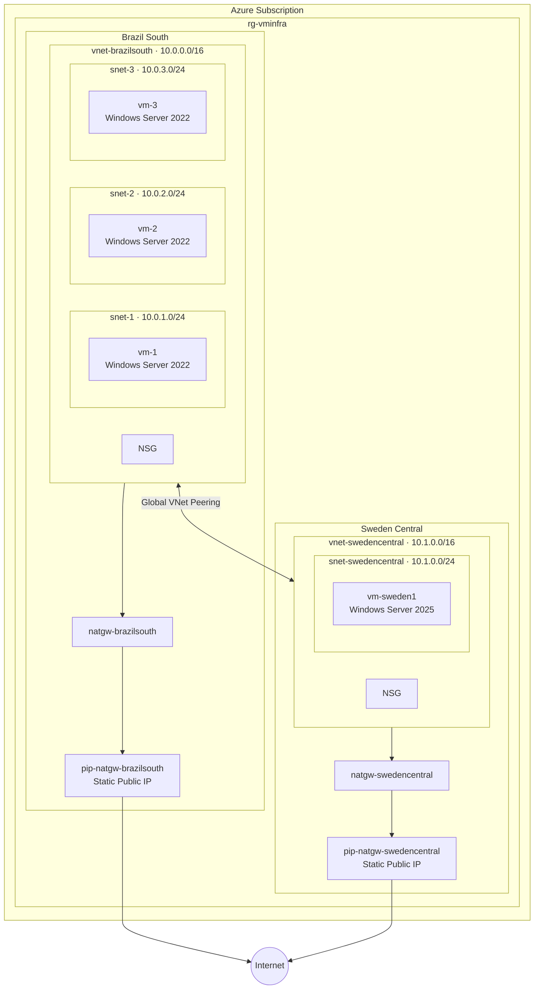

# VM Infrastructure - Azure Developer CLI Template


[](http://armviz.io/#/?load=https%3A%2F%2Fraw.githubusercontent.com%2Ffabioharams%2FVMINFRA%2Fmaster%2Finfra%2Fmain.bicep)

This `azd` template deploys **4 Windows Server virtual machines** across two Azure regions with private networking and global VNet peering.

This template is ideal for anyone who wants to quickly spin up a demo environment to test monitoring solutions. The multi-region, multi-VM setup provides a realistic scenario for evaluating tools like Azure Monitor, Log Analytics, or third-party monitoring agents across different regions and network topologies.

## Diagram of the solution



## Architecture

### Brazil South
- **3x Virtual Machines** (`vm-1`, `vm-2`, `vm-3`) — `Standard_D2as_v5`, Windows Server 2022 Datacenter Gen2
- **1x Virtual Network** `vnet-brazilsouth` — `10.0.0.0/16`
- **3x Subnets** — `snet-1` (`10.0.1.0/24`), `snet-2` (`10.0.2.0/24`), `snet-3` (`10.0.3.0/24`) — one VM per subnet
- **NAT Gateway** `natgw-brazilsouth` — with static public IP (`pip-natgw-brazilsouth`) for outbound internet
- **Network Security Group** — attached to all subnets

### Sweden Central
- **1x Virtual Machine** (`vm-sweden1`) — `Standard_D2as_v5`, Windows Server 2025 Datacenter Gen2
- **1x Virtual Network** `vnet-swedencentral` — `10.1.0.0/16`
- **1x Subnet** — `snet-swedencentral` (`10.1.0.0/24`)
- **NAT Gateway** `natgw-swedencentral` — with static public IP (`pip-natgw-swedencentral`) for outbound internet
- **Network Security Group** — attached to the subnet

### Cross-Region Connectivity
- **Global VNet Peering** — bidirectional peering between `vnet-brazilsouth` and `vnet-swedencentral`
- **No public IP addresses** — all VMs are only accessible via private IPs

## Prerequisites

- [Azure Developer CLI (azd)](https://learn.microsoft.com/azure/developer/azure-developer-cli/install-azd)
- An Azure subscription

## Getting Started

1. **Clone the repository**:

   ```bash
   git clone https://github.com/fabioharams/VMINFRA.git
   cd VMINFRA
   ```

2. **Set environment variables** for the VM admin credentials:

   ```bash
   azd env set AZURE_VM_ADMIN_USERNAME <your-username>
   azd env set AZURE_VM_ADMIN_PASSWORD <your-secure-password>
   ```

3. **Provision the infrastructure**:

   ```bash
   azd up
   ```

4. **Clean up** when done:

   ```bash
   azd down
   ```

## Configuration

### Main Parameters

| Parameter           | Default              | Description                                       |
|---------------------|----------------------|---------------------------------------------------|
| `location`          | `brazilsouth`        | Azure region for the Brazil South VMs              |
| `resourceGroupName` | `rg-vminfra`         | Resource group name                                |
| `vmCount`           | `3`                  | Number of VMs to deploy in Brazil South            |
| `vmSize`            | `Standard_D2as_v5`   | VM instance size (all VMs)                         |
| `vmNamePrefix`      | `vm`                 | Prefix for Brazil South VM names (vm-1, vm-2, vm-3)|
| `adminUsername`      | *(env var)*          | Administrator username for all VMs                 |
| `adminPassword`      | *(env var)*          | Administrator password for all VMs                 |

### Networks

| VNet                  | Address Space  | Region          | Subnets                                                        | NAT Gateway            |
|-----------------------|----------------|-----------------|----------------------------------------------------------------|------------------------|
| `vnet-brazilsouth`    | `10.0.0.0/16`  | Brazil South    | `snet-1` (`10.0.1.0/24`), `snet-2` (`10.0.2.0/24`), `snet-3` (`10.0.3.0/24`) | `natgw-brazilsouth`   |
| `vnet-swedencentral`  | `10.1.0.0/16`  | Sweden Central  | `snet-swedencentral` (`10.1.0.0/24`)                           | `natgw-swedencentral`  |

### Virtual Machines

| VM Name             | Region          | OS Image                              | Subnet                |
|---------------------|-----------------|---------------------------------------|------------------------|
| `vm-1`              | Brazil South    | Windows Server 2022 Datacenter Gen2   | `snet-1`               |
| `vm-2`              | Brazil South    | Windows Server 2022 Datacenter Gen2   | `snet-2`               |
| `vm-3`              | Brazil South    | Windows Server 2022 Datacenter Gen2   | `snet-3`               |
| `vm-sweden1`        | Sweden Central  | Windows Server 2025 Datacenter Gen2   | `snet-swedencentral`   |
